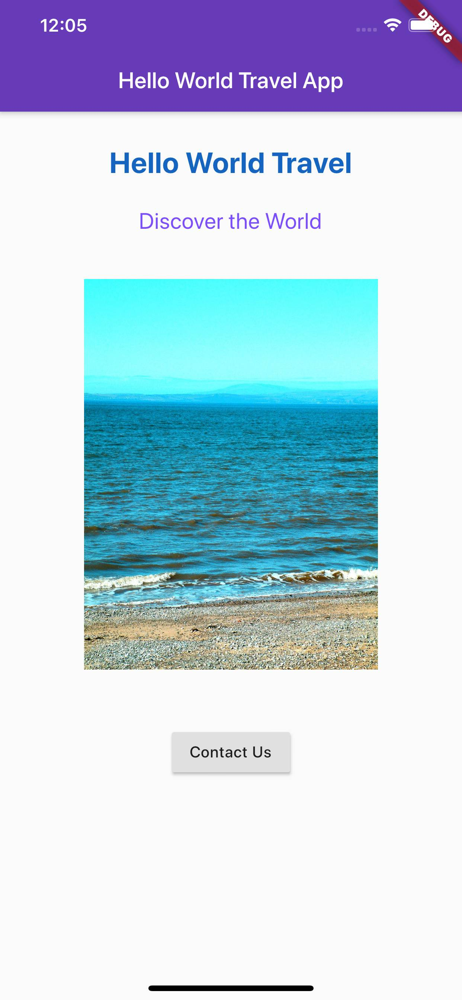

## Dart语言基础

在线运行： [DartPad](https://dartpad.dartlang.org/)

面向对象讲解：[How to explain object-oriented programming concepts to a 6-year-old](https://www.freecodecamp.org/news/object-oriented-programming-concepts-21bb035f7260/)

私有变量以下划线 _ 开头

[Material Design](https://material.io/)

## 扩展阅读

* [Flutter安装](https://flutter.dev/docs/get-started/install)
* [Chrome OS 安装 Flutter](https://proandroiddev.com/flutter-development-on-a-pixelbook-dde984a3fc1e)
* [Material Design](https://material.io/)
* [Flutter Community on Medium](https://medium.com/flutter-community)