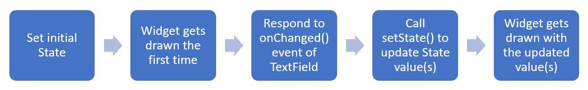

## Flutter 有状态控件

## Stateful Widget运行流程示例

## 扩展阅读

* [Flutter 布局](https://flutter.dev/docs/development/ui/layout)
* [TextFields](https://flutter.dev/docs/cookbook/forms/text-input)
* [DropdownButton](https://docs.flutter.io/flutter/material/DropdownButton-class.html)
