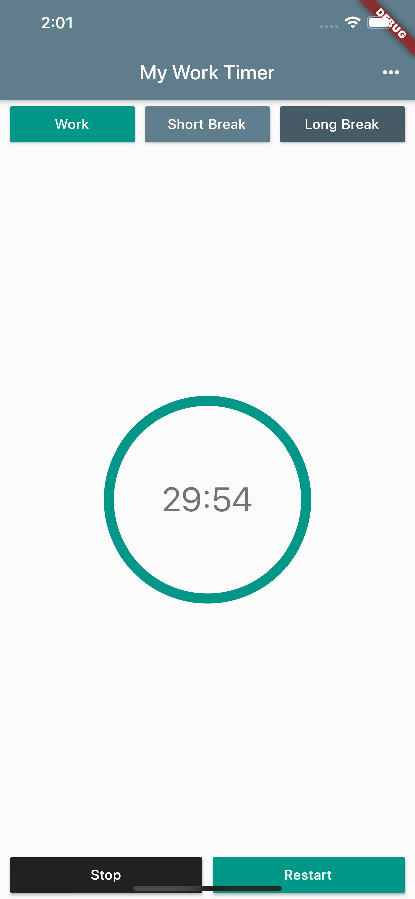
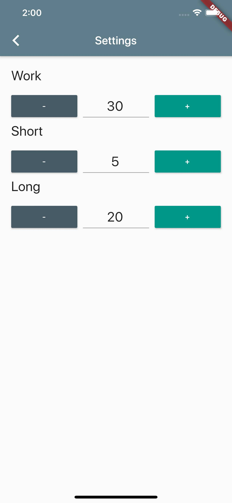

* [配色工具](https://www.materialpalette.com/)
* [percent_indicator](https://pub.dev/packages/percent_indicator)
* [shared_preferences)](https://pub.dev/packages/shared_preferences)

## 项目最终效果

## 扩展阅读

* 项目灵感来源： [Deep Work by Cal Newport](https://www.calnewport.com/books/deep-work/)
* [Dart异步编程Futures](https://dart.dev/codelabs/async-await)
* [Dart异步编程Streams](https://dart.dev/tutorials/language/streams)
* [Flutter函数式编程](https://buildflutter.com/functional-programming-with-flutter/)