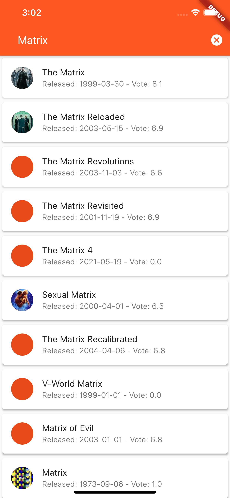
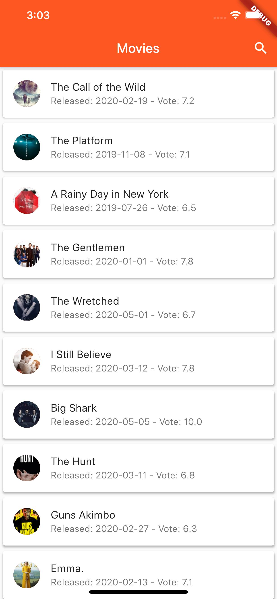
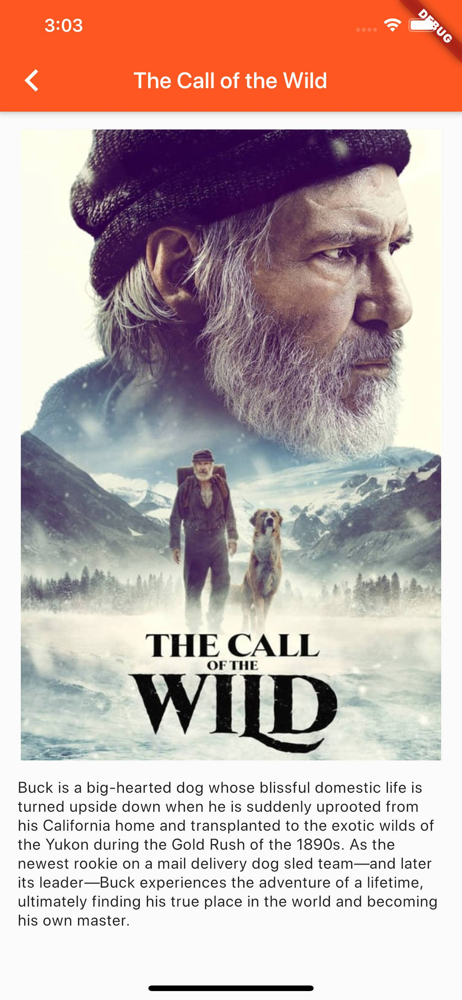

* [Movie Database API](https://www.themoviedb.org/)
* [http 库](https://pub.dev/packages/http)
* [Flutter icons](https://api.flutter.dev/flutter/material/Icons-class.html)

## 项目最终效果

## 扩展阅读
* [从网络获取数据](https://flutter.dev/docs/cookbook/networking/fetch-data)
* [异步编程](https://dart.dev/codelabs/async-await)
* [JSON序列化](https://flutter.dev/docs/development/data-and-backend/json)
* [ListView](https://api.flutter.dev/flutter/widgets/ListView-class.html)
* [单元测试](https://flutter.dev/docs/cookbook/testing/unit/introduction)