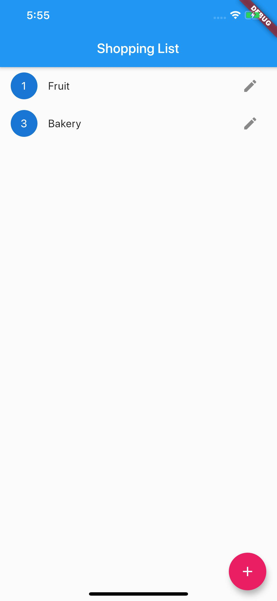

* [SQL教程](https://www.w3schools.com/sql/default.asp)
* [SQLite 速度](https://sqlite.org/fasterthanfs.html)
* [SQLite 占用空间](https://sqlite.org/footprint.html)
* [SQLite Tutorial](https://www.sqlitetutorial.net/)
* [Singleton Pattern](https://en.wikipedia.org/wiki/Singleton_pattern)

SQLite 五种数据类型：`NULL`、`INTEGER`、`REAL`、`TEXT`、`BLOB`

## 项目最终效果
