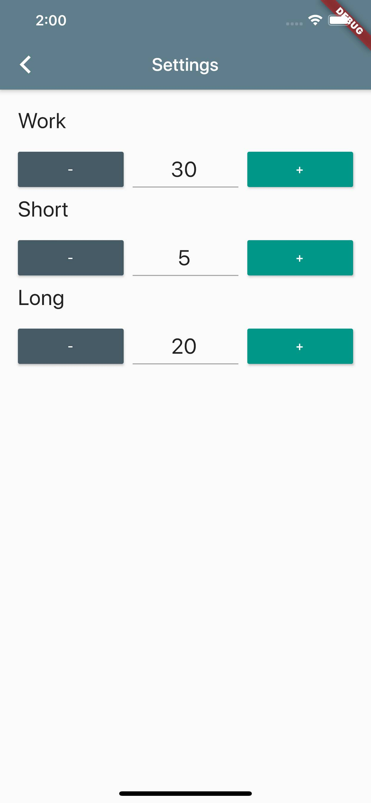
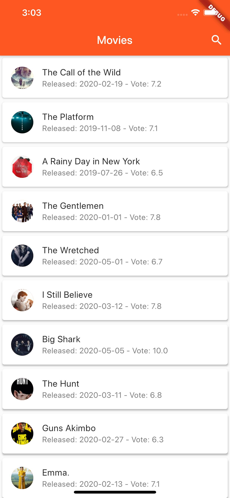

# Flutter Projects

国内使用 flutter 时，可配置镜像进行加速

```
export PUB_HOSTED_URL=https://pub.flutter-io.cn
export FLUTTER_STORAGE_BASE_URL=https://storage.flutter-io.cn
```

## 常用命令

```
flutter doctor
flutter create hello_world
flutter run
```

## 快捷键/命令
```
stless
stful
```

### 项目一：Hello World Travel 


### 项目二：Measures Converter


### 项目三：Productivity Timer



### 项目四：Pong Game


### 项目五：Let's Go to the Movies

